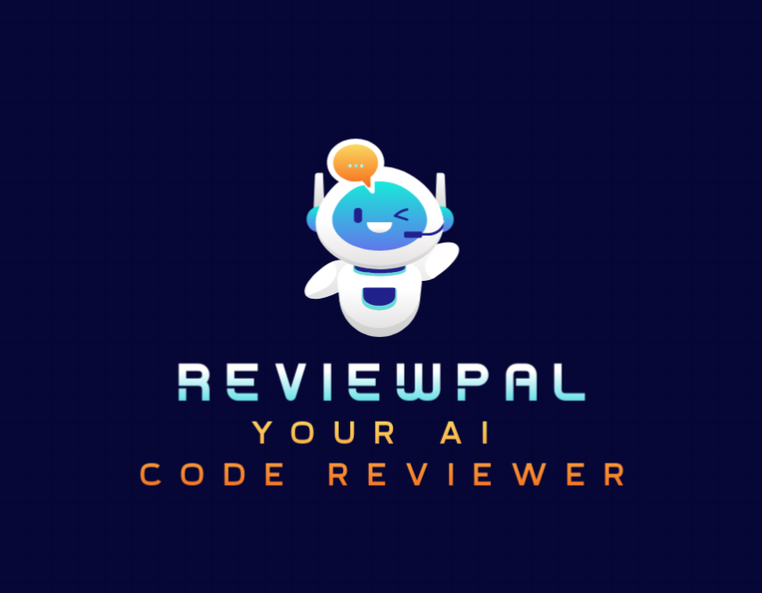

<a name="top"></a>
<div align="center">


# ReviewPal The first pull request reviewer AI agent


**🤖🔍 Your AI-powered senior pull request reviewer. Accelerate your growth by receiving constructive feedback and code review.**

</div>

## Table of Contents

1. [Introduction](#introduction)
2. [Installation](#installation)
3. [Configuration](#configuration)
4. [Usage](#usage)
5. [Documentation](#documentation)
6. [Conclusion](#conclusion)

## Introduction

ReviewPal is a cutting edge technology designed to help developers up their coding game by receiving code reviews from a senior AI agent.

### Why have your code reviewed

Getting reviews from a more senior peer that pushes you to deliver quality while maintaining coding principles will help you grow naturally as a developer since you will be enhancing quality each time.


## Installation

**Confirmed successful runs on the following:**

- Operating Systems:
  - Windows 10
  - Ubuntu 22
- Python versions:
  - 3.11.9(64b)

### Option 1: Using Python Virtual Environment 

1. **Download and Install Python:**

   Ensure you have the last Python version  installed. If not, download and install it from Python's official website. For detailed instructions, refer to the tutorials:

   - [How to Install Python on Windows](https://www.geeksforgeeks.org/how-to-install-python-on-windows/)
   - [How to Install Python on Linux](https://www.geeksforgeeks.org/how-to-install-python-on-linux/)
   - [How to Download and Install Python on macOS](https://www.geeksforgeeks.org/how-to-download-and-install-python-latest-version-on-macos-mac-os-x/)

2. **Clone the repository:**

   ```bash
   git clone https://github.com/Maokli/ReviewPal.git
   
   cd ReviewPal
   ```

3. **Activate virtual environment:**

   For Unix-based machines -
   ```bash
   python3 -m venv virtual
   ```

   ```bash
   source virtual/bin/activate
   ```

   or for Windows-based machines -

   ```bash
   .\virtual\Scripts\activate
   ```

4. **Install the required packages:**

   Before installing the required packages, make sure to install https://visualstudio.microsoft.com/visual-cpp-build-tools/ and select "Desktop development with C++".

   ```bash
   pip install -r requirements.txt
   ```

## Configuration

### 1. .env file
create a .env file with a structure similar to what you see in .env.example
```
GITHUB_ACCESS_TOKEN=asdqdqdsqdqsqd
AZURE_OPENAI_API_KEY=asdqdqdsqdqsqd
OPENAI_API_KEY=dsqdqdqdqdqs
```

You will always need a github access token, as for the model you are free to choose AZURE OPENAI or OPENAI.
In case AZURE OPEN AI is chosen, you will need to change the client in the src/presentation/cli.py so that an azure open ai llm is instantiated.

## Usage

1. **Environment:**
   Ensure that your .env file exists in the root folder under the ReviewPal directory with the github and open ai keys.
   Ensure that requirements are installed.

2. **Run the Agent:**
  Run the following command

   ```bash
   python .∕src∕presentation∕cli.py --url {pull request url}
   ```

  an example would be:
  ```bash
  python ./src/presentation/cli.py --url https://github.com/Maokli/ReviewPal/pull/9
  ```
3. **Running tests**
  To run unit tests just run the following command
   ```bash
   pytest
   ```

### Troubleshooting

#### 1. OpenAI API Rate Limit Errors

**Error Message:**

openai.RateLimitError: Error code: 429 - {'error': {'message': 'You exceeded your current quota, please check your plan and billing details. For more information on this error, read the docs: <https://platform.openai.com/docs/guides/error-codes/api-errors>.', 'type': 'insufficient_quota', 'param': None, 'code': 'insufficient_quota'}}

**Solution:**

- Check your OpenAI API billing settings at <https://platform.openai.com/account/billing>
- Ensure you have added a valid payment method to your OpenAI account
- Note that ChatGPT Plus subscription is different from API access
- If you've recently added funds or upgraded, wait 12-24 hours for changes to take effect
- Free tier has a 3 RPM limit; spend at least $5 on API usage to increase

## Documentation

### For Users
- [OpenAI API Documentation](https://platform.openai.com/docs/)

### For Developers

- [Lang Chain Developer Documentation](https://python.langchain.com/v0.2/docs/integrations/components/)


- If you encounter any issues, you can open an issue on [GitHub](https://github.com/Maokli/ReviewPal/issues).
  Please add valuable details to the subject and to the description. If you need a new feature then please reflect this.  
  I'll be more than happy to assist you!

- Note for Contributors: If you would like to submit a Pull Request (PR), please target the `main` branch and mentioning the issue you're addressing by putting its link

## Conclusion

ReviewPal provides a significant advantage in sponsoring your growth as a developer as it puts its users in a feedback loop with a more senior pal ensuring best practices are always looked at and applied.

[Back to top 🚀](#top)